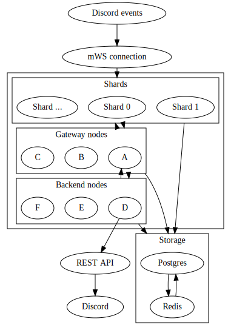

# amybot shards

The magical thing that dumps Discord events into the backend. :tm:

Due to some needs of mine, this is also a Discord API library, of sorts. Eventually I'll be able to replace JDA, but not any time soon

## Badges

[](http://forthebadge.com) 
[](http://forthebadge.com)
[](http://forthebadge.com)
[](http://forthebadge.com)
[](http://forthebadge.com)
[](http://forthebadge.com)


## How is everything connected?

This simple graph should explain it all quite nicely



## wtf is wrong with you

Well JDA didn't support what I wanted, and external caching + raw mWS event access is nice. 

## Configuration

The following environment variables are used. Defaults are shown here.

```bash
# The token for your bot
BOT_TOKEN="no default provided, obviously"
# The URL of your redis host. Currently can only be used in single-node mode, but I want to add cluster support eventually
REDIS_HOST="redis"
REDIS_PASS="a"
```

## Other

### Some thoughts on caching

- **Redisson is not used anymore.** While unfortunate, this decision was made because Redisson was just like "lol what is serializing correctly :S" and decided to blow it up using the Jackson codec. 
- All guilds have their own object in the cache
- All users have their own object in the cache
- All members lists are a part of their respective guild objects, as a set of Member objects
- Member objects reference their user object by snowflake

### Caching format

#### Single objects

Guild: `guild:snowflake:bucket`

User: `user:snowflake:bucket`

Member: `member:guild_snowflake:user_snowflake:bucket`

Channel: `channel:snowflake:bucket`

#### Snowflake sets

Users: `user:sset`

Guilds: `guild:sset`

Members: `member:guild_snowflake:sset`?

Channels: `channel:sset`